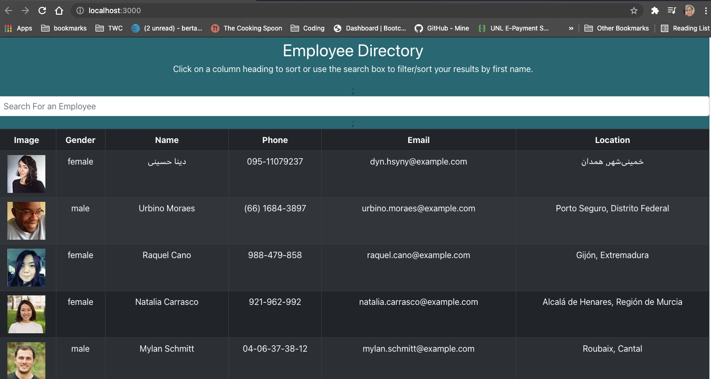

# Employee Directory

## Table of Contents
* [Description](#description)
* [Technology](#technology)
* [Screenshots](#screenshots)
* [Demonstration](#demonstration)

## Description
This employee directory, created using React, is an application designed so the user can view nonsensative information about employees. The user can filter employees by last name using the search bar or sort employees by first name by clicking any column heading.

### Click this link to view the deployed application (https://michelleberta.github.io/employee-directory) 

## Technology
* ReactJS
* JSX
* Random User API

## Screenshots

## Demonstration
